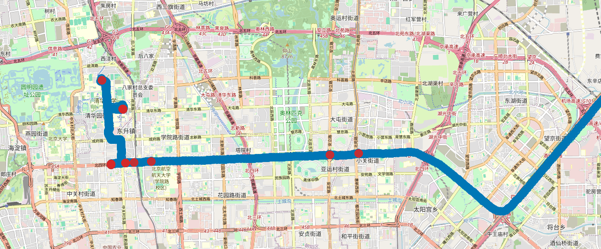

# GPS Stop Detection App

This project provides a FastAPI web application for detecting stops in GPS trajectory data using machine learning. 



## Requirements

- Docker installed on your system
- GPS trace files in CSV format
- Modern web browser for the interface

## Data Format

The uploaded `.csv` files must contain the following columns:

| Column         | Type              | Description                                                                 |
|----------------|-------------------|-----------------------------------------------------------------------------|
| `device_id`    | string            | Identifier for the GPS device (e.g., vehicle or user ID).                  |
| `trace_number` | integer           | Trace sequence number (e.g., session or trip ID).                          |
| `timestamp`    | string (datetime) | Timestamp in ISO 8601 format, e.g., `2024-05-17T14:35:10`.                 |
| `geometry`     | string (WKT)      | GPS coordinates in Well-Known Text (WKT), e.g., `POINT(4.395 51.209)`.     |

### Example Data Format
```csv
device_id,trace_number,timestamp,geometry
device_001,1,2024-05-17T14:35:10,POINT(4.395 51.209)
device_001,1,2024-05-17T14:35:15,POINT(4.396 51.210)
device_001,1,2024-05-17T14:35:20,POINT(4.395 51.209)
```

---

## Features

- **File Upload**: Upload single or multiple GPS trajectory files (`.csv`) through a web interface
- **Stop Detection**: Detect stops using a trained machine learning model (RandomForestClassifier)
- **Interactive Maps**: Visualize detected stops and paths on interactive Folium maps
- **Model Explainability**: Understand model predictions with SHAP feature importance plots
- **Batch Processing**: Process multiple traces simultaneously

---

## How the Model Works

This project uses a supervised learning approach for stop detection. The training process was as follows:

### Training Data Preparation
1. A dataset of GPS traces was provided by the client, TravelTrack Inc.
2. Stops in this dataset were labeled using a **rule-based approach**:
   - A point is considered "stopped" if `speed_kmh < 1`
   - Only stop segments with a total duration of **at least 5 seconds** are retained
   - Unrealistic outliers were removed

### Feature Engineering

- **Distance metrics**: Distance between consecutive GPS points.
- **Spatial coordinates**: Latitude and longitude values.
- To prevent data leakage, we exclude time (distance/time = one-to-one relationship with stop labels).


### Model Training
3. The labeled GPS points were split into **training** (60%), **validation** (20%), and **test** (20%) sets
4. A **Random Forest Classifier** was trained with hyperparameter optimization
5. Model performance was validated using cross-validation

### Model Performance

**Test Set Results** (Final model evaluation):
```
              precision    recall  f1-score   support

       False       1.00      0.99      1.00      1762
        True       0.72      1.00      0.84        23

    accuracy                           0.99      1785
   macro avg       0.86      1.00      0.92      1785
weighted avg       1.00      0.99      1.00      1785
```

**Validation Set Results** (Model tuning):
```
              precision    recall  f1-score   support

       False       1.00      0.99      1.00      1804
        True       0.52      1.00      0.68        17

    accuracy                           0.99      1821
   macro avg       0.76      1.00      0.84      1821
weighted avg       1.00      0.99      0.99      1821
```

**Note**: The model is optimized for high recall in stop detection (True class), meaning it captures all actual stops but may include some false positives. The test set shows improved precision (72%) compared to validation (52%), indicating good generalization. This conservative approach ensures no genuine stops are missed.

**Important Note**: The rule-based method is **only used during the training phase** to create labels. When you upload a GPS trace via the app, **only the trained ML model** is applied to predict stops.

---

## Installation & Setup

### Option 1: Docker (Recommended)

1. **Clone the repository**
```bash
git clone https://github.com/rluyck/gps-stop-detection.git
cd gps-stop-detection
```

2. **Build the Docker image**
```bash
docker build --no-cache -t gps-stop-detector -f docker/Dockerfile .
```

3. **Start the container**
```bash
docker run -p 8000:8000 gps-stop-detector
```

4. **Access the web interface**
   - Open your browser and visit: http://localhost:8000

### Option 2: Local Development

1. **Clone and navigate to repository**
```bash
git clone https://github.com/rluyck/gps-stop-detection.git
cd gps-stop-detection
```

2. **Install dependencies**
```bash
pip install -r requirements.txt
```

3. **Run the application**
```bash
uvicorn main:app --host 0.0.0.0 --port 8000 --reload
```

---

## Usage

1. **Upload Files**: Select one or more CSV files with GPS traces
2. **Process Data**: Click "Run" to start stop detection
3. **View Results**: 
   - Interactive map showing detected stops (red markers) and paths (blue lines)
   - SHAP feature importance plots explaining model decisions
   - Summary statistics of detected stops

### Expected Output
- **Map Visualization**: Interactive Folium map with stop locations and trajectory paths
- **Stop Summary**: Number of stops detected, total stop duration, and stop locations
- **Feature Importance**: SHAP plots showing which features influenced stop predictions

---

## TO DO

- unit tests
- clean api script

---
