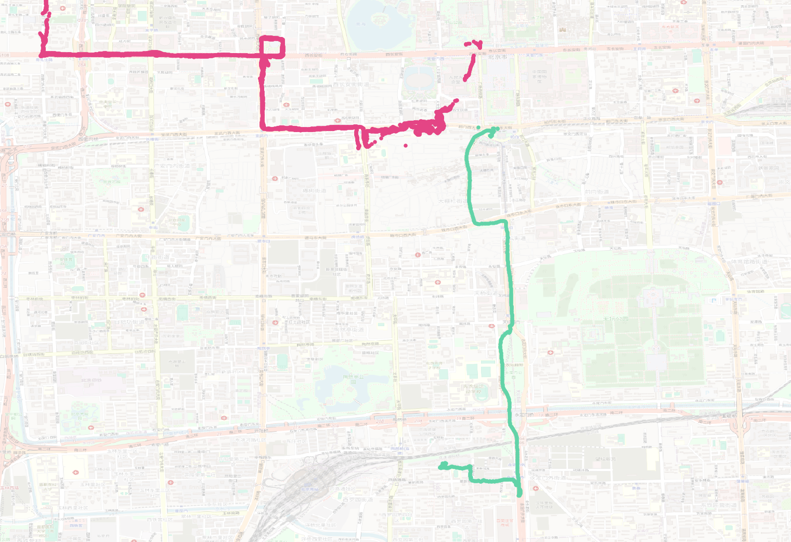

## Case: GPS Traces Analysis

### Introduction
If you are reading this, you are doing a second round of interview for the Senior Data Scientist position at Data Wizards. We are excited to see your analytical thinking and problem-solving approach in action!

### Context
Our client, TravelTrack Inc., has provided us with a dataset containing GPS traces. These traces consist of timestamped GPS coordinates (in CRS 4326) along with device identifiers. The client wants to gain insights into vehicle movement patterns, particularly to identify stops.

### Dataset
You are provided with a CSV file containing GPS traces data with the following structure:

| Field | Description |
|-------|-------------|
| geom_wkt | Geometry in WKT format, CRS 4326 |
| trace_number | Sequential identifier for each journey |
| device_id | Unique identifier for each GPS device/vehicle |
| ts | Timestamp in format YYYY-MM-DD HH:MM:SS |


*Figure 1: Visualization of sample GPS traces showing vehicle movements and potential stops.*

Sample data:
```
geom_wkt	trace_number	device_id	ts
POINT (116.391305 39.898573)	1	19	2008-12-11 04:42:14+00
POINT (116.391317 39.898617)	1	19	2008-12-11 04:42:16+00
POINT (116.390928 39.898613)	1	19	2008-12-11 04:43:26+00
POINT (116.390833 39.898635)	1	19	2008-12-11 04:43:32+00
POINT (116.38941 39.898723)	1	19	2008-12-11 04:43:47+00

```

### Your Task
Your mission is to develop algorithms to extract meaningful insights from the GPS traces. Specifically, we'd like you to:

1. Identify vehicle stops (locations where vehicles remain stationary for a certain period)
2. Create visualizations to communicate your findings
3. Nice to have: detect patterns or behaviors in the data

Feel free to take some inspiration from existing solutions, but make sure to not just use a library for this task. This is the opportunity to show us all your creativity building advanced algorithms, your feature engineering skills and the mathematical knowledge you hold!

### Deliverables
We expect the following for this take-home assignment:

- A Python solution that processes the GPS data and creates a machine learning model to identify stops
- An API endpoint (using Flask or FastAPI) that allows processing of a single (or multiple) raw GPS trace
- A Dockerfile to containerize your solution
- A README file explaining your approach, assumptions, and instructions to run the solution


When you've completed the assignment, please share your private GitHub repository with us or send us a zipfile with your solution. We'll review it before the second interview, where you'll have the opportunity to present your approach, findings, and insights.

Should you have any questions, please don't hesitate to reach out.

Good luck!